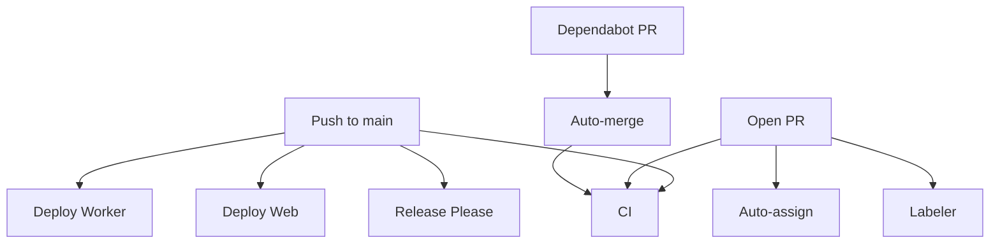

# GitHub Actions Workflows

This document describes all automated workflows for Shorly.

## 🔄 Continuous Integration

### **CI** (`ci.yml`)
**Triggers:** PRs and pushes to `main`

**Jobs:**
1. **Lint** - ESLint check
2. **Type Check** - TypeScript validation
3. **Unit Tests** - Jest with 100% coverage
4. **Build** - Verify all apps build successfully

**Used by:** Every PR and commit

---

## 🚀 Deployment

### **Deploy Worker** (`deploy-worker.yml`)
**Triggers:** 
- Push to `main` (when `apps/worker/**` changes)
- Manual dispatch

**What it does:**
- Builds and deploys Cloudflare Worker
- Handles edge redirects for short links

**Required secrets:**
- `CLOUDFLARE_API_TOKEN`
- `CLOUDFLARE_ACCOUNT_ID`

---

### **Deploy Web** (`deploy-web.yml`)
**Triggers:**
- Push to `main` (when `apps/web/**` or `packages/**` changes)
- Manual dispatch

**What it does:**
- Builds Next.js frontend
- Deploys to Cloudflare Pages

**Required secrets:**
- `CLOUDFLARE_API_TOKEN`
- `CLOUDFLARE_ACCOUNT_ID`
- `NEXT_PUBLIC_API_URL`
- `NEXT_PUBLIC_APP_URL`

---

## 🤖 Automation

### **Auto-assign PRs** (`auto-assign.yml`)
**Triggers:** PR opened/reopened

**What it does:**
- Automatically assigns @salemaljebaly to all PRs
- Skips draft PRs

---

### **Dependabot Auto-merge** (`dependabot-automerge.yml`)
**Triggers:** Dependabot PRs

**What it does:**
1. Auto-approves Dependabot PRs
2. Enables auto-merge
3. Merges after CI passes

---

### **PR Labeler** (`labeler.yml`)
**Triggers:** PR opened/synchronized

**What it does:**
- Auto-labels PRs based on changed files
- Labels: `api`, `frontend`, `worker`, `tests`, `docs`, etc.

---

### **Label Sync** (`label-sync.yml`)
**Triggers:** 
- Push to `main` (when `.github/labels.yml` changes)
- Manual dispatch

**What it does:**
- Syncs repository labels from `.github/labels.yml`
- Removes labels not in config

---

### **Release Please** (`release-please.yml`)
**Triggers:** Push to `main`

**What it does:**
1. Creates release PR based on conventional commits
2. Generates CHANGELOG.md
3. Bumps version in package.json
4. Creates GitHub release
5. Uploads release artifacts

---

## 📊 Workflow Dependencies



---

## 🔐 Required Secrets

Set these in **GitHub Settings → Secrets and variables → Actions**:

| Secret | Description | Used By |
|--------|-------------|---------|
| `CLOUDFLARE_API_TOKEN` | Cloudflare API token | Worker & Web deployment |
| `CLOUDFLARE_ACCOUNT_ID` | Cloudflare account ID | Worker & Web deployment |
| `NEXT_PUBLIC_API_URL` | Production API URL | Web deployment |
| `NEXT_PUBLIC_APP_URL` | Production app URL | Web deployment |

---

## 🎯 Manual Triggers

These workflows can be triggered manually from GitHub Actions tab:

- **Deploy Worker** - Deploy worker without code changes
- **Deploy Web** - Deploy web app without code changes
- **Label Sync** - Force sync labels

---

## ⚙️ Workflow Status Badges

Add to README.md:

```markdown


```
